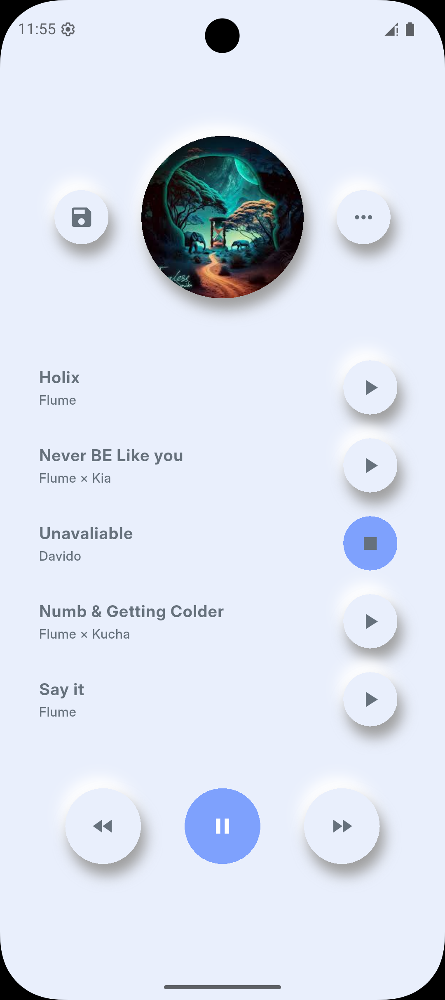
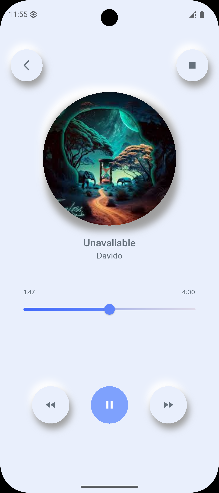

# 📱 Music App UI - Flutter

## 📌 Project Description
A simple Flutter training application designed to demonstrate some of the most commonly used **UI Widgets**.

The app includes practical examples of:

- **Row** ➝ arrange items horizontally
- **Column** ➝ arrange items vertically
- **Text** ➝ display text
- **Image** ➝ display images
- **Icon** ➝ add icons
- **SizedBox** ➝ create spacing or define fixed sizes
- **Container** ➝ customize layout, padding, borders, and colors
- **Slider** ➝ add adjustable sliders
- **SliderTheme** ➝ customize the style and look of sliders
- **ShaderMask** ➝ apply gradients and effects on widgets
- **InkWell** ➝ adds interactivity for gestures
- **SingleChildScrollView** ➝ provides scrollable behavior for content
- **ListTile** ➝ builds a list item widget with various customization options
- **Padding** ➝ add padding around widgets
- **Image.asset** ➝ display images from the local asset folder

---

## 📌 Project Goal
The purpose of this project is to practice and understand the usage of **basic Flutter Widgets** while building a simple UI as part of **Music App UI**.

---

## 🛠️ Technologies Used

### Frontend

-   Flutter 3.16
-   Dart 3.0

### App Tools

-   flutter_launcher_icons
-   rename

---

### App Launcher Icon
(assets/images/logo.png)

---

## 🎥 Application Demo

🎬 https://www.youtube.com/watch?v=STv2Aqc6vsU

---

## 📷 Screenshots

|Screen 1 | Screen 2 |
| --- | --- |
|  |  |

## 📌 Project Structure

```plaintext
MUSIC_APP_UI-MAIN/
├── lib/                               # Contains the main application code
│   ├── constant/                      # Constants like colors, dimensions, paths
│   │   ├── colors.dart                # Defines color constants
│   │   ├── dimensions.dart            # Defines UI dimensions (padding, margins, etc.)
│   │   ├── paths.dart                 # Defines file paths and other constants
│   ├── custom_widgets_design/         # Custom-designed widgets
│   │   ├── custom_circular_widget.dart # Custom circular widget
│   │   ├── custom_list_tile.dart      # Custom list tile widget
│   │   ├── media_control_buttons.dart # Media control buttons widget
│   ├── pages/                         # Contains the pages/screens of the app
│   │   ├── music_list_page.dart       # Music list page screen
│   │   ├── music_page.dart            # Music player page screen
│   ├── main.dart                      # Main entry point of the application
├── assets/                            # Static files like images and fonts
│   ├── images/                        # Images used in the app
│   ├── fonts/                         # Fonts used in the app
├── pubspec.yaml                       # Project dependencies and configurations
├── README.md                          # Project documentation
```

----

## 👤 Author

Sama Shurrab

----

## 📜 License

Open-source
